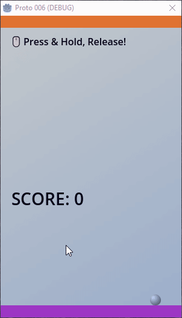

# Pincrediball Prototype 006

This is the sixth prototype, published purely for fun.
There will probably be no further documentation or info or updates on this repository.

Technically it's not even a prototype; it's more an experiment with Godot 4.0.
Just to see how Godot works.

Check out [the pincrediball.com devlog](https://www.pincrediball.com/devlog) for more in-depth updates about development.

## Animation

Here's an animated image showing how this "prototype" (mini-game) worked:

